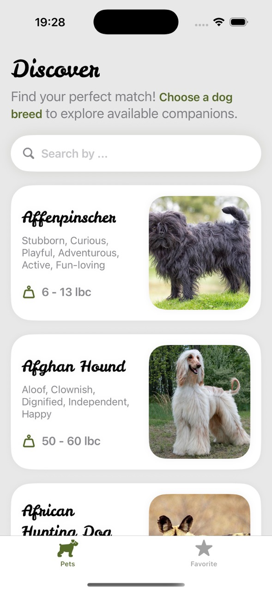
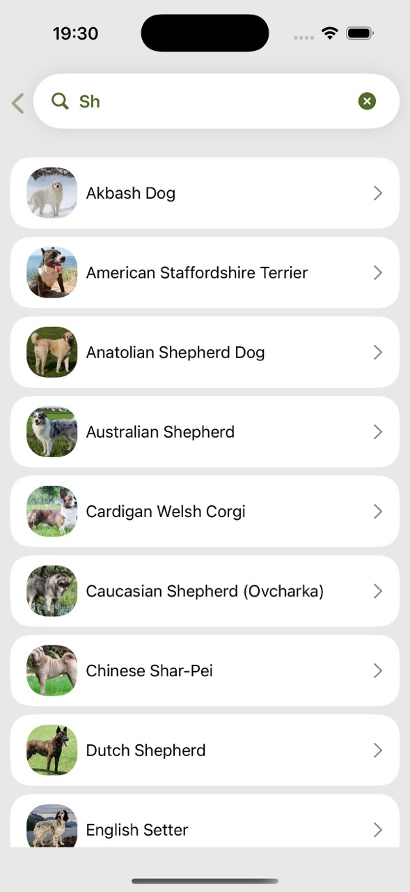
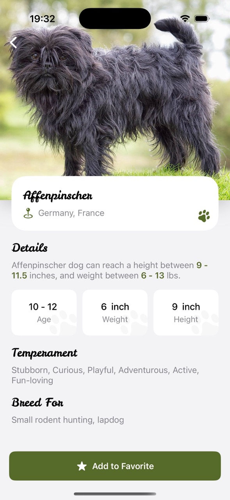
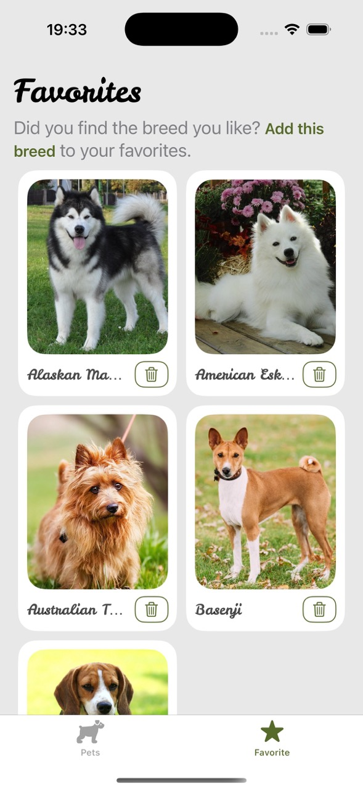

# Snout Scout

*A simple app for discovering dog breeds*

An iOS 16+ app for exploring dog breeds, viewing images, and saving favorites — built with MVVM architecture.

## 🐶 Features
- Detailed breed information  
- Breed images  
- Breed list with search  
- Add breeds to favorites  
- Infinite scroll

## 🔧 Tech Stack
- MVVM
- SwiftUI  
- Combine  
- Core Data (for favorites)  
- [TheDogAPI](https://thedogapi.com)  
- NukeUI (for image loading)

## 📸 Screenshots

<table>
  <tr>
    <td></td>
    <td></td>
  </tr>
  <tr>
    <td></td>
    <td></td>
  </tr>
</table>
